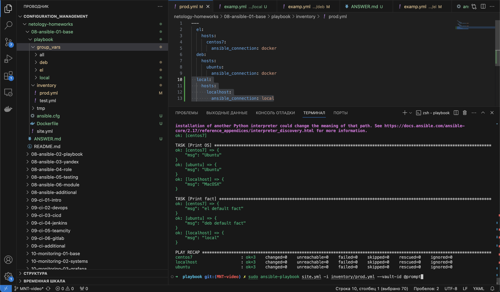

# Обязательная часть
## Задания 1-6

Задания 1-6 были выполнены в соответствии с требованиями. Для заданий была развернуты контейнеры в docker:

```
docker build -f Dockerfile -t my_os_image . 
docker run -d --name ubuntu my_os_image
docker run -d --name centos7 my_os_image
```

запуск осуществлялся с помощью:

```
sudo ansible-playbook site.yml -i inventory/prod.yml
```

## Задания 7-8

```
ansible-vault encrypt group_vars/deb/examp.yml
ansible-vault encrypt group_vars/el/examp.yml
```

при запуске пароль не запрашивался и выдавалась ошибка "ERROR! Attempting to decrypt but no vault secrets found". Запрос пароля осуществлялся с явно указанным параметром --vault-id @prompt:
```
sudo ansible-playbook site.yml -i inventory/prod.yml --vault-id @prompt
```

## Задания 9-11
В соответствии с заданием в prod.yml добавлена новая группу хостов с именем local



при запуске пароль не запрашивался и выдавалась ошибка "ERROR! Attempting to decrypt but no vault secrets found". Запрос пароля осуществлялся с явно указанным параметром --vault-id @prompt:
```
sudo ansible-playbook site.yml -i inventory/prod.yml --vault-id @prompt
```


# Необязательная часть

## Задание 1
```
ansible-vault decrypt group_vars/deb/examp.yml --vault-password-file <(echo 'netology')
ansible-vault decrypt group_vars/el/examp.yml --vault-password-file <(echo 'netology')
```

## Задания 2-3
```
➜  playbook git:(MNT-video) ✗ ansible-vault encrypt_string --vault-password-file <(echo 'netology') 'PaSSw0rd' --name 'some_fact'

Encryption successful
some_fact: !vault |
          $ANSIBLE_VAULT;1.1;AES256
          36356331373265636531636563316435313266353963613037636330393433636135303162396562
          6462353337303264663334613962636266626564313866380a376230343031373862323961396336
          35396635333236373463613234653837333138323262383837633335373831353336613162396233
          3135393738386432350a656132313464646536366232303136306633656532363230316239396266
          6563
```

## Задания 4-5

В рамках задания был создан скрипт run_ansible.sh, Dockerfile_fedora а также внесены изменения в проект в соответствии с требованиями задания