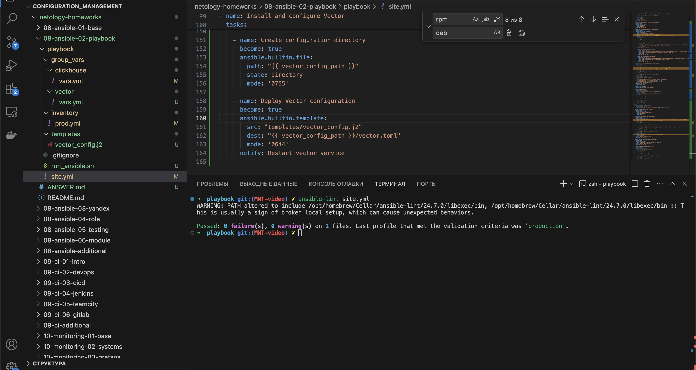
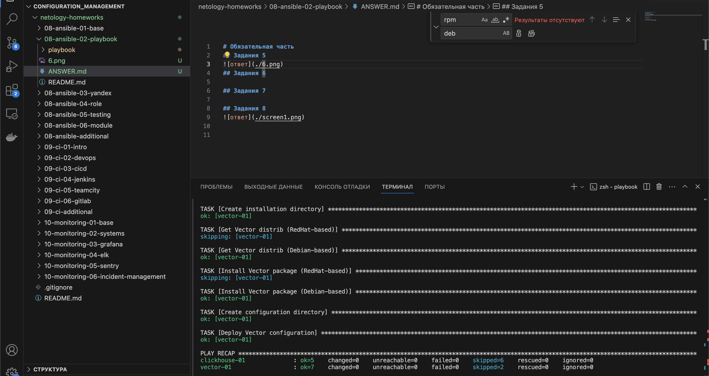

# Описание
Данный playbook реализует скачивание и установку clickhouse и vector на конечные хосты в рамках второго занятия 2 по теме «Работа с Playbook»
Для запуска необходимо изменить настройки подключения для конечных узлов в inventory/prod.yml а также версию пакетов в group_vars

# Решение
## Задания 5

## Задания 6-8

