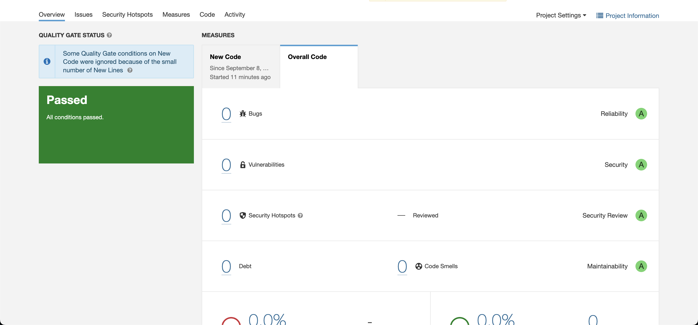
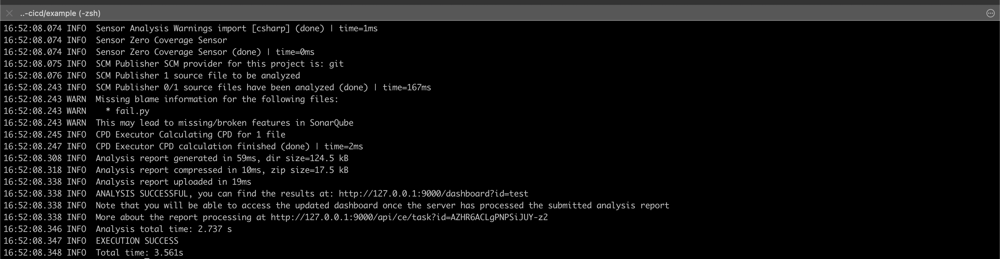
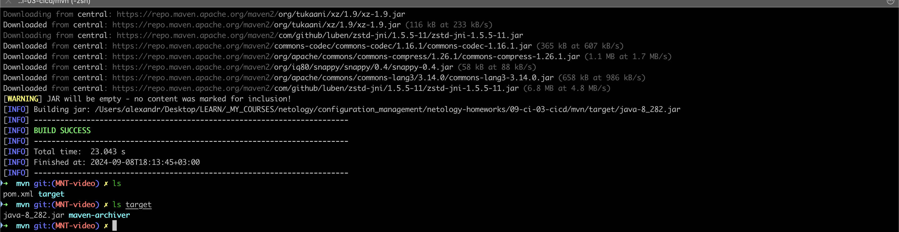

# Описание

# Решение:

## Знакомоство с SonarQube




## Знакомство с Nexus

```
<metadata modelVersion="1.1.0">
<groupId>netology</groupId>
<artifactId>java</artifactId>
<versioning>
<latest>8_282</latest>
<release>8_282</release>
<versions>
<version>8_102</version>
<version>8_282</version>
</versions>
<lastUpdated>20240908140832</lastUpdated>
</versioning>
</metadata>
```

## Знакомство с Maven

