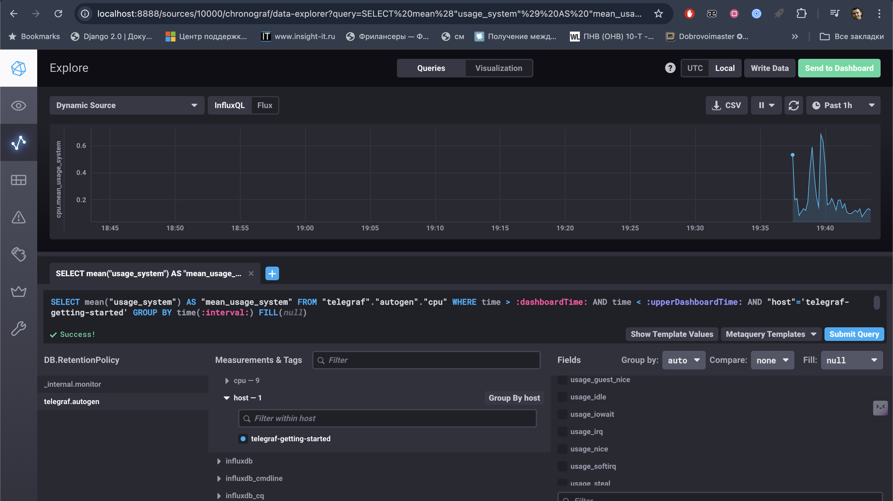

#Ответы
### 1. Минимальный набор метрик для мониторинга:
- **CPU Usage** – Контроль загрузки процессора.
- **Memory Usage (RAM)** – Мониторинг использования оперативной памяти.
- **Disk Space/Inodes** – Контроль дискового пространства и инодов.
- **HTTP Response Codes** – Отслеживание успешных и неуспешных запросов.
- **HTTP Latency** – Задержка отклика сервера.
- **I/O Wait Time** – Время ожидания ввода/вывода.

### 2. Метрики для менеджера продукта:
- **Уровень доступности (SLA/SLO)** – Процент успешных HTTP-запросов.
- **Время обработки отчётов** – Скорость выполнения вычислений.
- **Число запросов на платформу** – Общее количество запросов.
- **Процент использования ресурсов** – Простая интерпретация загрузки системы.

### 3. Решение для передачи ошибок разработчикам:
- **Локальные логи с ротацией** – Сбор логов с автоматической ротацией.
- **Email/Webhook уведомления** – Оповещения о критических ошибках.
- **APM-инструменты** – Использование Sentry или аналогов для уведомления об ошибках.

### 4. Ошибка в расчёте SLA:
- **Потерянные запросы** – Запросы могут теряться или зависать.
- **Редиректы (3xx)** – Не учитываются как успешные.
- **Неправильный подсчёт запросов** – Проверьте корректность подсчёта всех запросов.

### 5. Модели мониторинга
Pull-модель: Мониторинговый сервер периодически запрашивает данные у агентов.
 - Плюсы: Упрощенное управление, контроль над сбором данных.
 - Минусы: Меньшая масштабируемость, возможные сетевые задержки.
Push-модель: Агенты отправляют данные на сервер по мере их готовности.
 - Плюсы: Хорошая масштабируемость, гибкость.
 - Минусы: Сложнее управлять агентами, зависимость от их состояния.

 ### 6. Системы мониторинга
Pull-модель:
 - Prometheus
 - Zabbix (по умолчанию)
Push-модель:
 - TICK (Telegraf, InfluxDB, Chronograf, Kapacitor)
 - Nagios
Гибридные модели:
 - VictoriaMetrics (может работать как в push, так и в pull-моделях)

### 7. 

### 8. 
