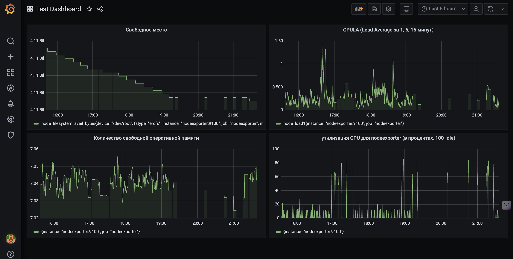

#Ответы

### Задание 2
1. Утилизация CPU (в процентах, 100-idle)
```
100 - (avg(rate(node_cpu_seconds_total{mode="idle"}[1m])) by (instance) * 100)
```

2. CPULA (Load Average за 1, 5, 15 минут)
```
Для 1 минуты:
node_load1

Для 5 минут:
node_load5

Для 15 минут:
node_load15
```

3. Количество свободной оперативной памяти
```
node_memory_MemAvailable_bytes
```

4. Количество места на файловой системе
```
(node_filesystem_avail_bytes{mountpoint="/"} / node_filesystem_size_bytes{mountpoint="/"}) * 100

```



### Задание 3
1. Утилизация CPU (в процентах, 100-idle)
```
avg(rate(node_cpu_seconds_total{mode="idle"}[1m])) by (instance) < 20
```

2. CPULA (Load Average за 1, 5, 15 минут)
```
node_load1 > count(count(node_cpu_seconds_total{mode="idle"}) by (cpu))
```

3. Количество свободной оперативной памяти
```
node_memory_MemAvailable_bytes / 1024 / 1024 / 1024 < 2

```

4. Количество места на файловой системе
```
(node_filesystem_avail_bytes{mountpoint="/"} / node_filesystem_size_bytes{mountpoint="/"}) * 100 < 20

```

### Задание 4

```
{
  "annotations": {
    "list": [
      {
        "builtIn": 1,
        "datasource": "-- Grafana --",
        "enable": true,
        "hide": true,
        "iconColor": "rgba(0, 211, 255, 1)",
        "name": "Annotations & Alerts",
        "type": "dashboard"
      }
    ]
  },
  "editable": true,
  "gnetId": null,
  "graphTooltip": 0,
  "id": 1,
  "links": [],
  "panels": [
    {
      "aliasColors": {},
      "bars": false,
      "dashLength": 10,
      "dashes": false,
      "datasource": null,
      "fieldConfig": {
        "defaults": {
          "custom": {}
        },
        "overrides": []
      },
      "fill": 1,
      "fillGradient": 0,
      "gridPos": {
        "h": 8,
        "w": 12,
        "x": 0,
        "y": 0
      },
      "hiddenSeries": false,
      "id": 8,
      "legend": {
        "avg": false,
        "current": false,
        "max": false,
        "min": false,
        "show": true,
        "total": false,
        "values": false
      },
      "lines": true,
      "linewidth": 1,
      "nullPointMode": "null",
      "options": {
        "alertThreshold": true
      },
      "percentage": false,
      "pluginVersion": "7.4.0",
      "pointradius": 2,
      "points": false,
      "renderer": "flot",
      "seriesOverrides": [],
      "spaceLength": 10,
      "stack": false,
      "steppedLine": false,
      "targets": [
        {
          "expr": "(node_filesystem_avail_bytes{mountpoint=\"/\"} / node_filesystem_size_bytes{mountpoint=\"/\"}) * 100",
          "interval": "",
          "legendFormat": "",
          "refId": "A"
        }
      ],
      "thresholds": [],
      "timeRegions": [],
      "title": "Свободное место",
      "tooltip": {
        "shared": true,
        "sort": 0,
        "value_type": "individual"
      },
      "type": "graph",
      "xaxis": {
        "buckets": null,
        "mode": "time",
        "name": null,
        "show": true,
        "values": []
      },
      "yaxes": [
        {
          "format": "short",
          "label": null,
          "logBase": 1,
          "max": null,
          "min": null,
          "show": true
        },
        {
          "format": "short",
          "label": null,
          "logBase": 1,
          "max": null,
          "min": null,
          "show": true
        }
      ],
      "yaxis": {
        "align": false,
        "alignLevel": null
      }
    },
    {
      "aliasColors": {},
      "bars": false,
      "dashLength": 10,
      "dashes": false,
      "datasource": null,
      "fieldConfig": {
        "defaults": {
          "custom": {}
        },
        "overrides": []
      },
      "fill": 1,
      "fillGradient": 0,
      "gridPos": {
        "h": 8,
        "w": 12,
        "x": 12,
        "y": 0
      },
      "hiddenSeries": false,
      "id": 4,
      "legend": {
        "avg": false,
        "current": false,
        "max": false,
        "min": false,
        "show": true,
        "total": false,
        "values": false
      },
      "lines": true,
      "linewidth": 1,
      "nullPointMode": "null",
      "options": {
        "alertThreshold": true
      },
      "percentage": false,
      "pluginVersion": "7.4.0",
      "pointradius": 2,
      "points": false,
      "renderer": "flot",
      "seriesOverrides": [],
      "spaceLength": 10,
      "stack": false,
      "steppedLine": false,
      "targets": [
        {
          "expr": "node_load1",
          "interval": "",
          "legendFormat": "",
          "refId": "A"
        }
      ],
      "thresholds": [],
      "timeRegions": [],
      "title": "CPULA (Load Average за 1, 5, 15 минут)",
      "tooltip": {
        "shared": true,
        "sort": 0,
        "value_type": "individual"
      },
      "type": "graph",
      "xaxis": {
        "buckets": null,
        "mode": "time",
        "name": null,
        "show": true,
        "values": []
      },
      "yaxes": [
        {
          "format": "short",
          "label": null,
          "logBase": 1,
          "max": null,
          "min": null,
          "show": true
        },
        {
          "format": "short",
          "label": null,
          "logBase": 1,
          "max": null,
          "min": null,
          "show": true
        }
      ],
      "yaxis": {
        "align": false,
        "alignLevel": null
      }
    },
    {
      "aliasColors": {},
      "bars": false,
      "dashLength": 10,
      "dashes": false,
      "datasource": null,
      "fieldConfig": {
        "defaults": {
          "custom": {}
        },
        "overrides": []
      },
      "fill": 1,
      "fillGradient": 0,
      "gridPos": {
        "h": 8,
        "w": 12,
        "x": 0,
        "y": 8
      },
      "hiddenSeries": false,
      "id": 6,
      "legend": {
        "avg": false,
        "current": false,
        "max": false,
        "min": false,
        "show": true,
        "total": false,
        "values": false
      },
      "lines": true,
      "linewidth": 1,
      "nullPointMode": "null",
      "options": {
        "alertThreshold": true
      },
      "percentage": false,
      "pluginVersion": "7.4.0",
      "pointradius": 2,
      "points": false,
      "renderer": "flot",
      "seriesOverrides": [],
      "spaceLength": 10,
      "stack": false,
      "steppedLine": false,
      "targets": [
        {
          "expr": "node_memory_MemAvailable_bytes / 1024 / 1024 / 1024",
          "interval": "",
          "legendFormat": "",
          "refId": "A"
        }
      ],
      "thresholds": [],
      "timeRegions": [],
      "title": "Количество свободной оперативной памяти",
      "tooltip": {
        "shared": true,
        "sort": 0,
        "value_type": "individual"
      },
      "type": "graph",
      "xaxis": {
        "buckets": null,
        "mode": "time",
        "name": null,
        "show": true,
        "values": []
      },
      "yaxes": [
        {
          "format": "short",
          "label": null,
          "logBase": 1,
          "max": null,
          "min": null,
          "show": true
        },
        {
          "format": "short",
          "label": null,
          "logBase": 1,
          "max": null,
          "min": null,
          "show": true
        }
      ],
      "yaxis": {
        "align": false,
        "alignLevel": null
      }
    },
    {
      "aliasColors": {},
      "bars": false,
      "dashLength": 10,
      "dashes": false,
      "datasource": null,
      "fieldConfig": {
        "defaults": {
          "custom": {}
        },
        "overrides": []
      },
      "fill": 1,
      "fillGradient": 0,
      "gridPos": {
        "h": 8,
        "w": 12,
        "x": 12,
        "y": 8
      },
      "hiddenSeries": false,
      "id": 2,
      "legend": {
        "avg": false,
        "current": false,
        "max": false,
        "min": false,
        "show": true,
        "total": false,
        "values": false
      },
      "lines": true,
      "linewidth": 1,
      "nullPointMode": "null",
      "options": {
        "alertThreshold": true
      },
      "percentage": false,
      "pluginVersion": "7.4.0",
      "pointradius": 2,
      "points": false,
      "renderer": "flot",
      "seriesOverrides": [],
      "spaceLength": 10,
      "stack": false,
      "steppedLine": false,
      "targets": [
        {
          "expr": "100 - (avg(rate(node_cpu_seconds_total{mode=\"idle\"}[1m])) by (instance) * 100)",
          "hide": false,
          "interval": "",
          "legendFormat": "",
          "refId": "A"
        }
      ],
      "thresholds": [],
      "timeFrom": null,
      "timeRegions": [],
      "timeShift": null,
      "title": "утилизация CPU для nodeexporter (в процентах, 100-idle)",
      "tooltip": {
        "shared": true,
        "sort": 0,
        "value_type": "individual"
      },
      "type": "graph",
      "xaxis": {
        "buckets": null,
        "mode": "time",
        "name": null,
        "show": true,
        "values": []
      },
      "yaxes": [
        {
          "format": "short",
          "label": null,
          "logBase": 1,
          "max": null,
          "min": null,
          "show": true
        },
        {
          "format": "short",
          "label": null,
          "logBase": 1,
          "max": null,
          "min": null,
          "show": true
        }
      ],
      "yaxis": {
        "align": false,
        "alignLevel": null
      }
    }
  ],
  "schemaVersion": 27,
  "style": "dark",
  "tags": [],
  "templating": {
    "list": []
  },
  "time": {
    "from": "now-6h",
    "to": "now"
  },
  "timepicker": {},
  "timezone": "",
  "title": "Test Dashboard",
  "uid": "0_UQTPRHk",
  "version": 3
}

```