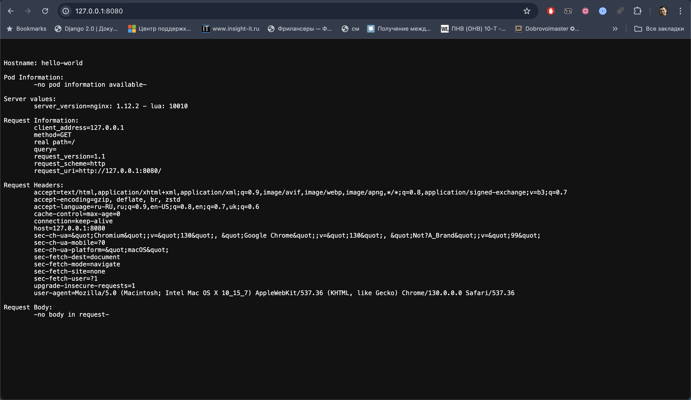
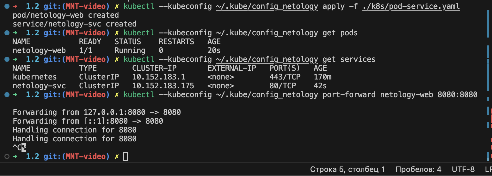

# Решение
Содержимое файлов .yaml можно посмотреть в директории ./k8s

## Задание 1. Создать Pod с именем hello-world
```
kubectl --kubeconfig ~/.kube/config_netology apply -f ./k8s/pod.yaml

Вывод после локального подключения к Pod с помощью kubectl port-forward в браузере:
```



## Задание 2. Создать Service и подключить его к Pod
```
kubectl --kubeconfig ~/.kube/config_netology apply -f ./k8s/pod-service.yaml
```
