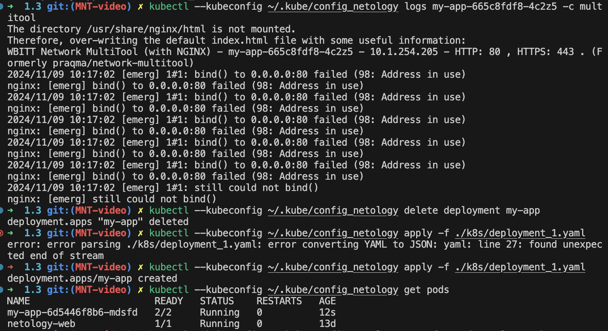
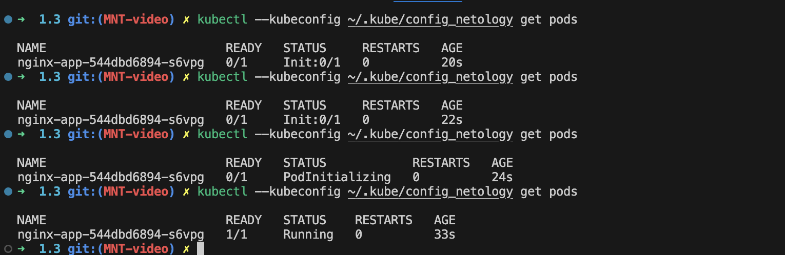

# Решение
Содержимое файлов .yaml можно посмотреть в директории ./k8s

## Задание 1. Создать Deployment и обеспечить доступ к репликам приложения из другого Pod
```
kubectl --kubeconfig ~/.kube/config_netology apply -f ./k8s/deployment_1.yaml

Вывод после локального подключения к Pod с помощью kubectl port-forward в браузере:
```



## Задание 2. Создать Deployment и обеспечить старт основного контейнера при выполнении условий
```
kubectl --kubeconfig ~/.kube/config_netology apply -f ./k8s/deployment_2.yaml
```
