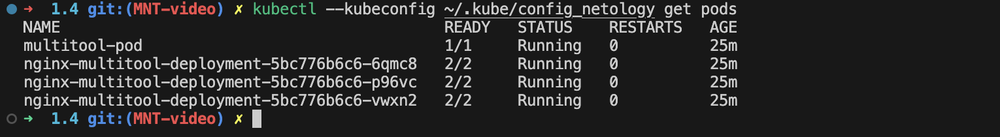
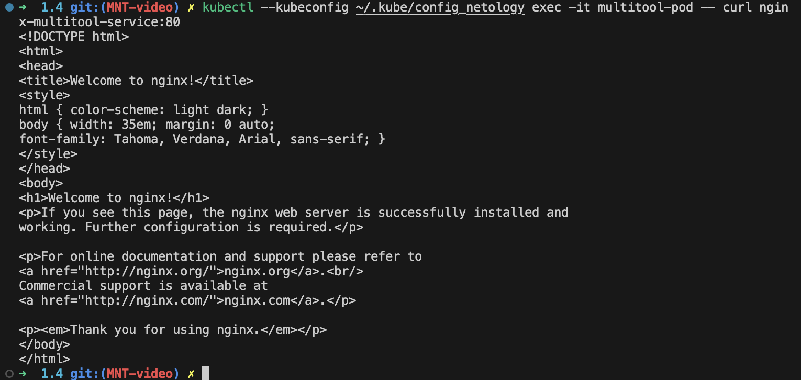
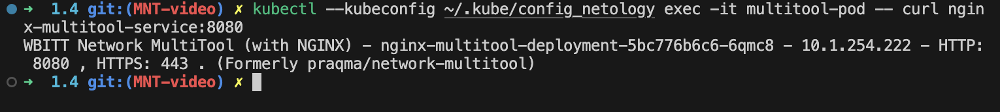
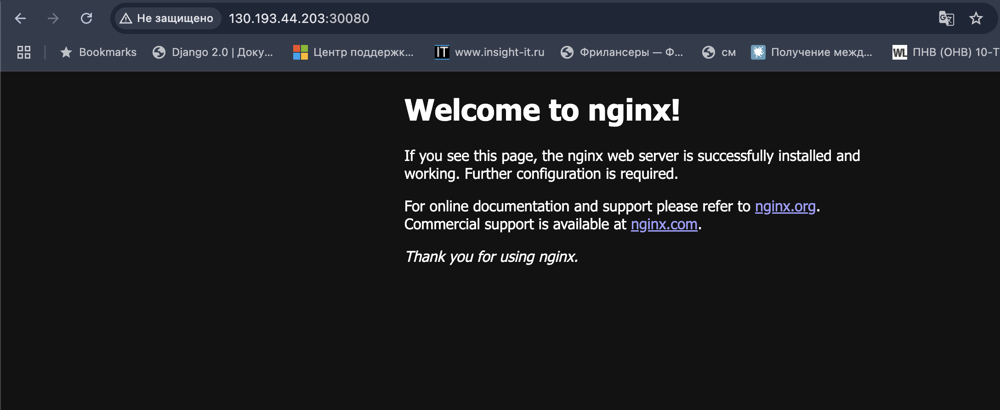

# Решение
Содержимое файлов .yaml для решения заданий можно посмотреть в директории ./k8s

## Задание 1.
запуск и остановка:
```
kubectl --kubeconfig ~/.kube/config_netology apply -f ./k8s/nginx-multitool.yaml
kubectl --kubeconfig ~/.kube/config_netology delete -f ./k8s/nginx-multitool.yam
```
Вывод после старта:

Вывод curl для nginx:

Вывод curl для multi-tool:



## Задание 2. 
запуск и остановка:
```
kubectl --kubeconfig ~/.kube/config_netology apply -f ./k8s/nginx-multitool.yaml
kubectl --kubeconfig ~/.kube/config_netology delete -f ./k8s/nginx-multitool.yam
```
Доступ к nginx извне после в несения изменений type -> NodePort
