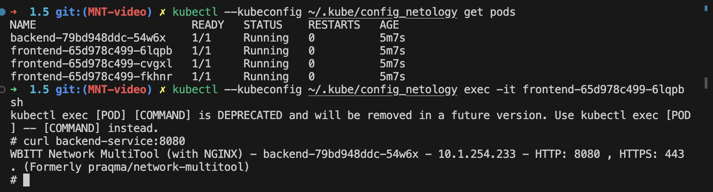
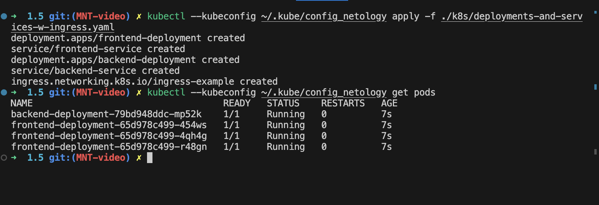
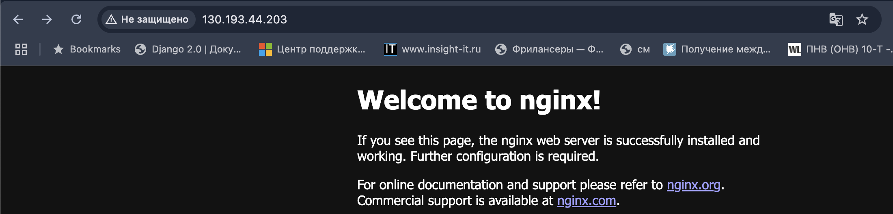
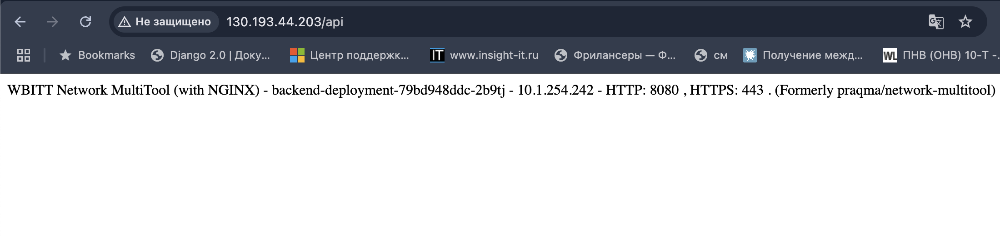

# Решение
Содержимое файлов .yaml для решения заданий можно посмотреть в директории ./k8s

## Задание 1.
запуск и остановка:
```
kubectl --kubeconfig ~/.kube/config_netology apply -f ./k8s/deployments-and-services.yaml
kubectl --kubeconfig ~/.kube/config_netology delete -f ./k8s/deployments-and-services.yaml
```
Вывод консоли:



## Задание 2. 
запуск и остановка:
```
kubectl --kubeconfig ~/.kube/config_netology apply -f ./k8s/nginx-multitool.yaml
kubectl --kubeconfig ~/.kube/config_netology delete -f ./k8s/nginx-multitool.yam
```

ingress:
```
microk8s enable ingress
microk8s kubectl get pods -n ingress
```
Доступ извне после включения ingress


