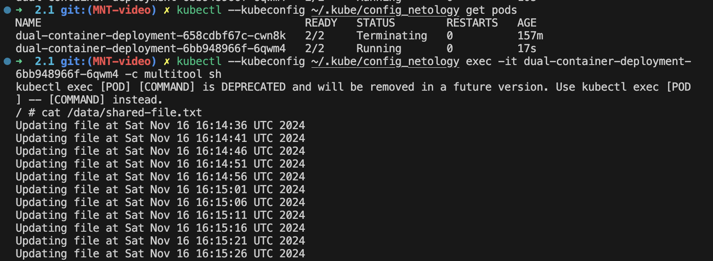
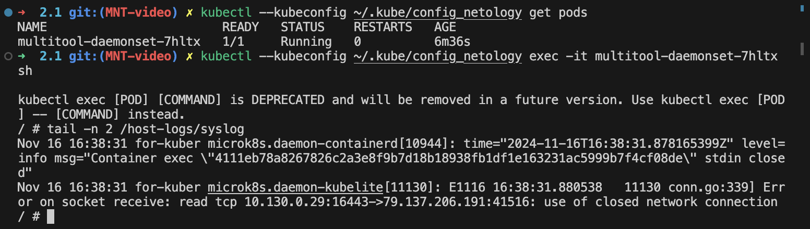

# Решение
Содержимое файлов .yaml для решения заданий можно посмотреть в директории ./k8s

## Задание 1.
запуск и остановка:
```
kubectl --kubeconfig ~/.kube/config_netology apply -f ./k8s/deployment.yaml
kubectl --kubeconfig ~/.kube/config_netology delete -f ../k8s/deployment.yaml
```
Результат доступа к файлу:



## Задание 2. 
запуск и остановка:
```
kubectl --kubeconfig ~/.kube/config_netology apply -f ./k8s/deployment_2.yaml
kubectl --kubeconfig ~/.kube/config_netology delete -f ./k8s/deployment_2.yaml
```
Скриншот доступа к хостовым логам:
