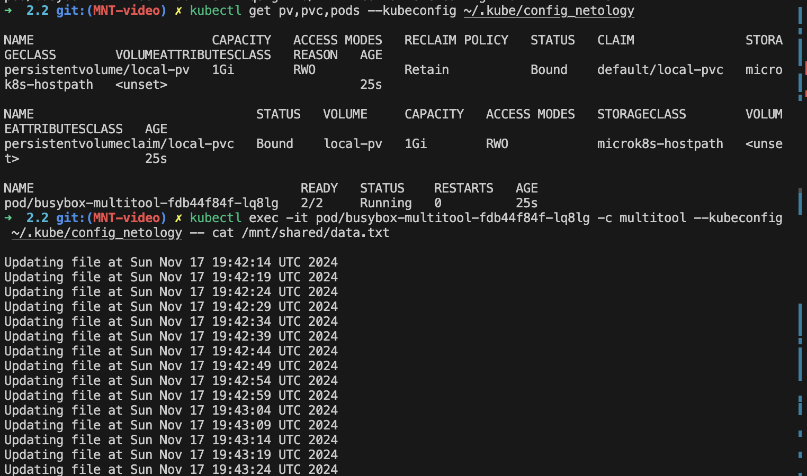
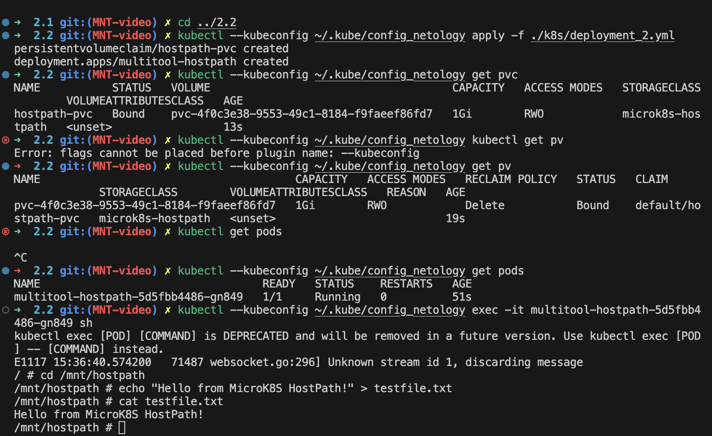

# Решение
Содержимое файлов .yaml для решения заданий можно посмотреть в директории ./k8s

## Задание 1.
запуск и остановка:
```
kubectl --kubeconfig ~/.kube/config_netology apply -f ./k8s/deployment.yaml
kubectl --kubeconfig ~/.kube/config_netology delete -f ../k8s/deployment.yaml
kubectl --kubeconfig ~/.kube/config_netology get pv,pvc,pods
kubectl --kubeconfig ~/.kube/config_netology exec -it pod/busybox-multitool-fdb44f84f-lq8lg -c multitool cat /mnt/shared/data.txt
```

Скриншот с результатами выполнения:



## Задание 2. 
запуск, остановка и прочие команды для проверки:
```
microk8s enable storage
kubectl --kubeconfig ~/.kube/config_netology apply -f ./k8s/deployment_2.yaml
kubectl --kubeconfig ~/.kube/config_netology delete -f ./k8s/deployment_2.yaml
kubectl --kubeconfig ~/.kube/config_netology kubectl get pv
kubectl --kubeconfig ~/.kube/config_netology kubectl get pvc
kubectl --kubeconfig ~/.kube/config_netology get pods
kubectl --kubeconfig ~/.kube/config_netology exec -it multitool-hostpath-5d5fbb4486-gn849 sh
cd /mnt/hostpath
echo "Hello from MicroK8S HostPath!" > testfile.txt
cat testfile.txt
```

Скриншот с результатами выполнения:
