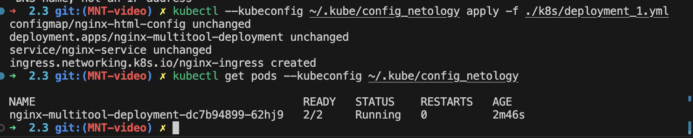
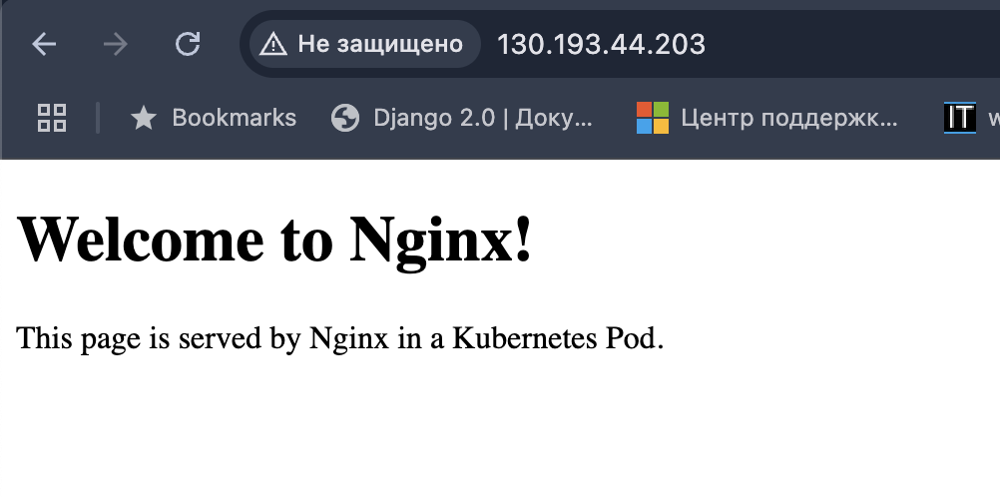
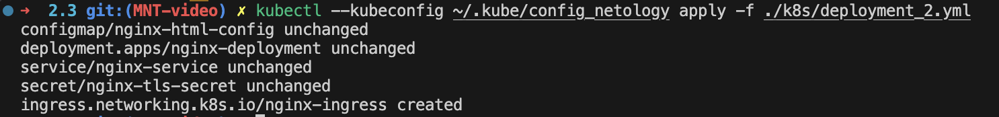
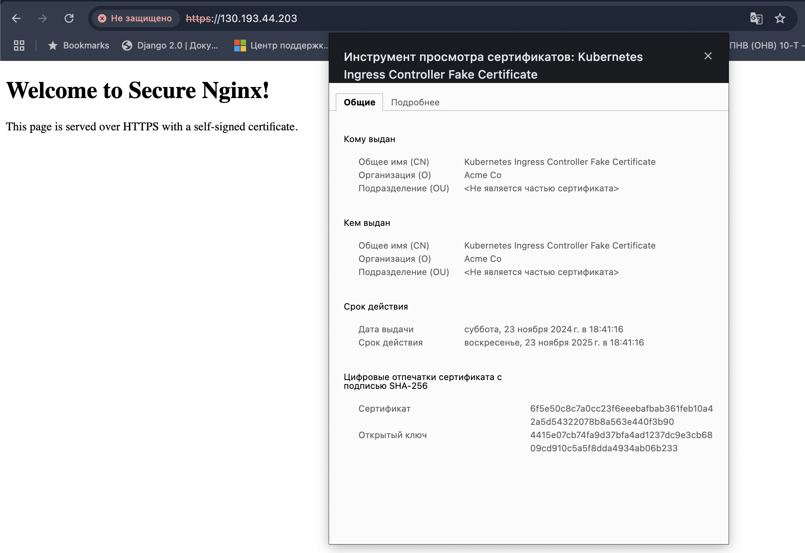

# Решение
Содержимое файлов .yaml для решения заданий можно посмотреть в директории ./k8s

## Задание 1.
запуск и остановка:
```
kubectl --kubeconfig ~/.kube/config_netology apply -f ./k8s/deployment.yaml
kubectl --kubeconfig ~/.kube/config_netology delete -f ../k8s/deployment.yaml
```

Скриншот с результатами выполнения:




## Задание 2. 
запуск, остановка и прочие команды для проверки:
```
microk8s enable storage
kubectl --kubeconfig ~/.kube/config_netology apply -f ./k8s/deployment_2.yaml
openssl req -x509 -nodes -days 365 -newkey rsa:2048 -keyout tls.key -out tls.crt -subj "/CN=130.193.44.203/O=MyOrg"
cat tls.crt | base64 -w0
cat tls.key | base64 -w0
kubectl --kubeconfig ~/.kube/config_netology delete -f ./k8s/deployment_2.yaml
```

Скриншот с результатами выполнения:

