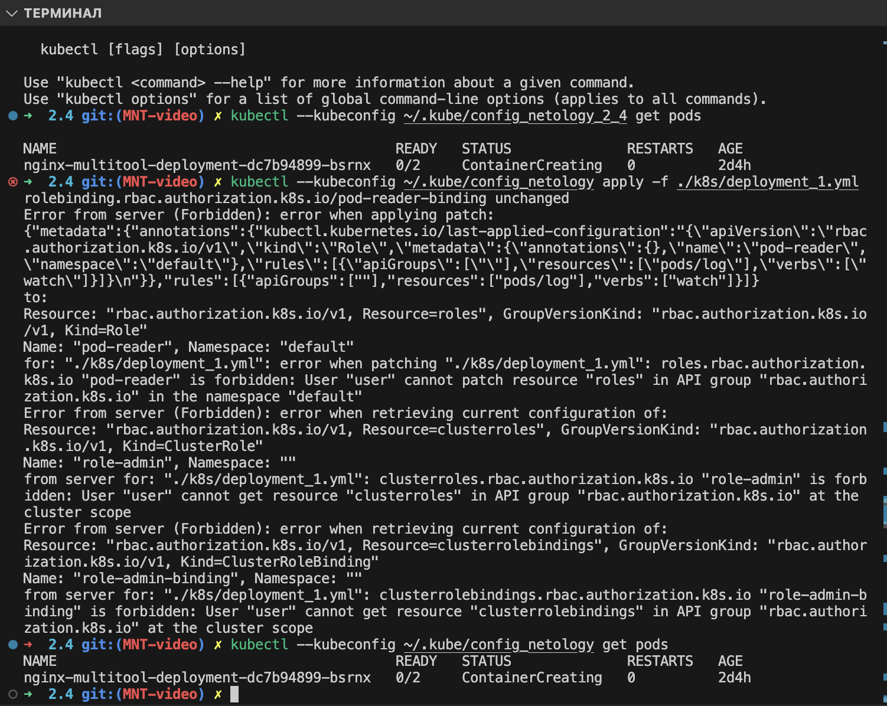

# Решение
Содержимое файлов .yaml для решения заданий можно посмотреть в директории ./k8s

## Задание 1.
команды необходимые для выполнения задания:
```
test@for-kuber:~$ openssl genrsa -out user.key 2048
test@for-kuber:~$ openssl req -new -key user.key -out user.csr -subj "/CN=user/O=group"
test@for-kuber:~$ openssl x509 -req -in user.csr -CA /var/snap/microk8s/current/certs/ca.crt 

cat /var/snap/microk8s/current/certs/ca.crt | base64 -w 0
cat user.crt | base64 -w 0
cat user.key | base64 -w 0

microk8s enable rbac

kubectl --kubeconfig ~/.kube/config_netology_2_4 apply -f ./k8s/deployment_1.yaml
kubectl --kubeconfig ~/.kube/config_netology_2_4 delete -f ../k8s/deployment_1.yaml
```
пример конфига находится в файле config_netology_2_4

Скриншот с примером выполнения команд с полным и ограниченным доступом:

