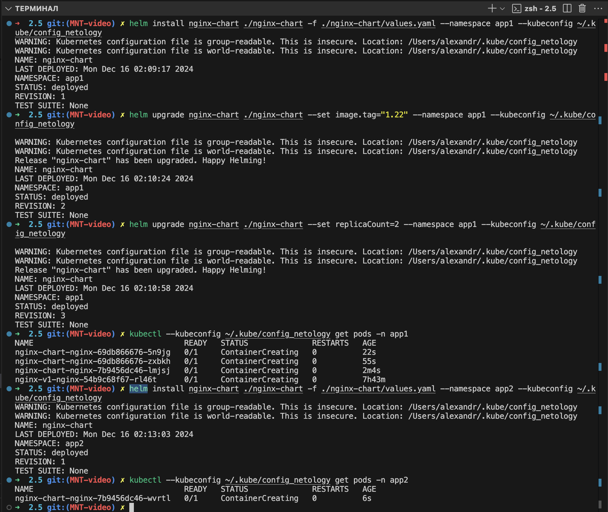
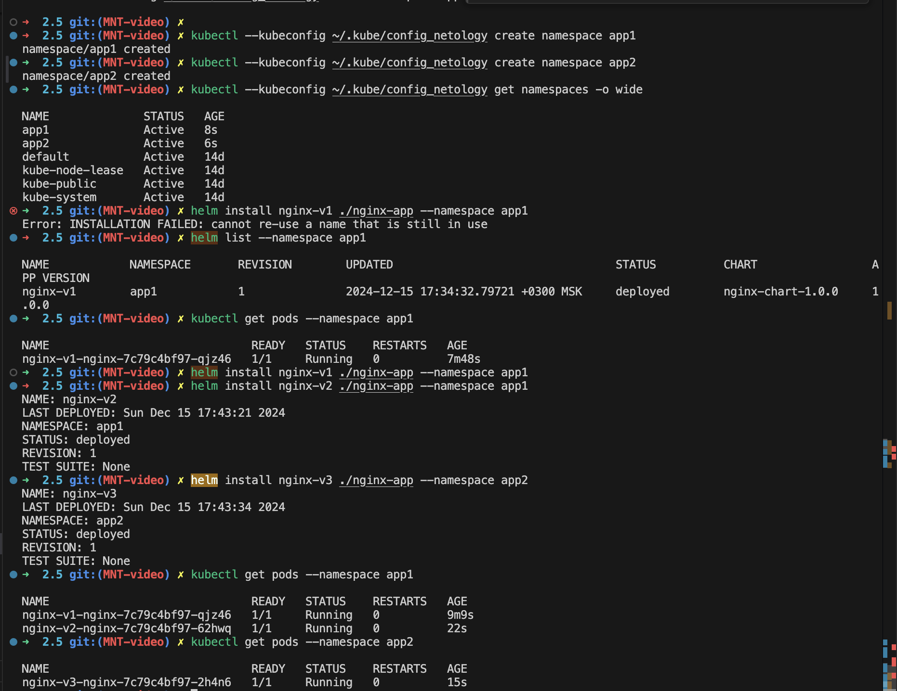

# Решение

## Задание 1.
основной код для задания находится в директории ./nginx-chart

команды необходимые для выполнения задания:
```
kubectl --kubeconfig ~/.kube/config_netology create namespace app1
kubectl --kubeconfig ~/.kube/config_netology create namespace app2
helm create nginx-chart

helm install nginx-chart ./nginx-chart -f ./nginx-chart/values.yaml --namespace app1 --kubeconfig ~/.kube/config_netology
helm install nginx-chart ./nginx-chart -f ./nginx-chart/values.yaml --namespace app2 --kubeconfig ~/.kube/config_netology

helm upgrade nginx-chart ./nginx-chart --set image.tag="1.22" --namespace app1 --kubeconfig ~/.kube/config_netology
helm upgrade nginx-chart ./nginx-chart --set replicaCount=2 --namespace app1 --kubeconfig ~/.kube/config_netology


```
пример конфига находится в файле config_netology_2_4

Скриншот с примером выполнения команд с полным и ограниченным доступом:



## Задание 2.
основной код для задания находится в директории ./nginx-app

команды необходимые для выполнения задания:
```
kubectl --kubeconfig ~/.kube/config_netology create namespace app1
kubectl --kubeconfig ~/.kube/config_netology create namespace app2

helm create nginx-app
helm install nginx-v1 ./nginx-app --namespace app1 --kubeconfig ~/.kube/config_netology
helm install nginx-v2 ./nginx-app --namespace app1 --kubeconfig ~/.kube/config_netology
helm install nginx-v2 ./nginx-app --namespace app1 --kubeconfig ~/.kube/config_netology

kubectl --kubeconfig ~/.kube/config_netology get pods -n app1
kubectl --kubeconfig ~/.kube/config_netology get pods -n app2
```
пример конфига находится в файле config_netology_2_4

Скриншот с примером выполнения команд с полным и ограниченным доступом:

