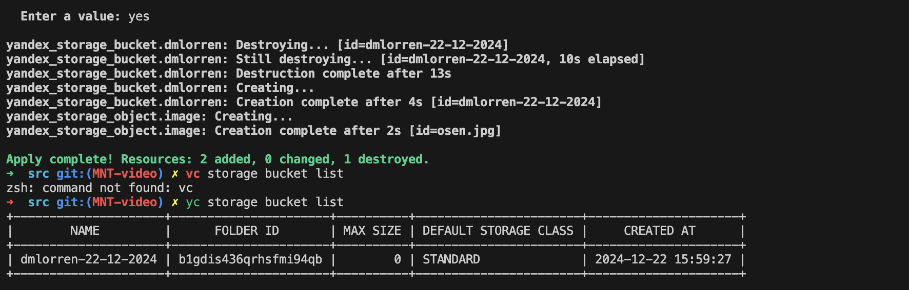
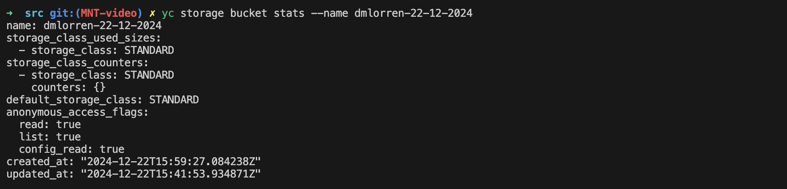
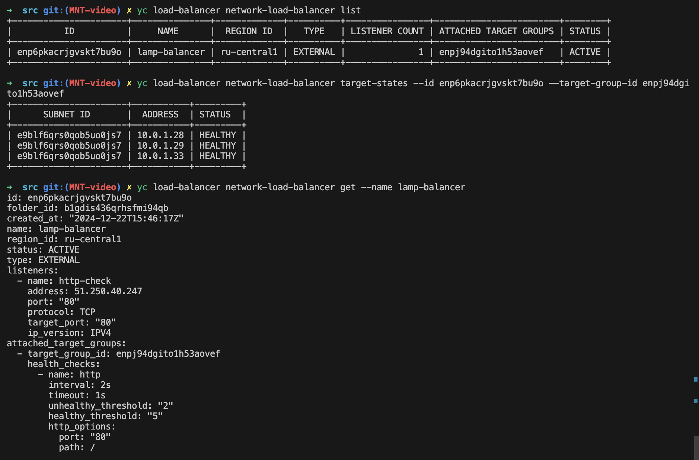

# Домашнее задание к занятию «Вычислительные мощности. Балансировщики нагрузки»

---
## Задание 1. Yandex Cloud 

Решение:

- подготовленные манифесты находятся в директории ./src

- список используемых команд:
```
terraform init
terraform apply
terraform validate
terraform plan

yc load-balancer network-load-balancer list
yc load-balancer network-load-balancer target-states --id enpeb5l1s3qgivn9a1q9 --target-group-id enpnrqpc7h7h179bramo
yc load-balancer network-load-balancer get --name lamp-balancer
yc compute instance list
```

- скриншоты выполнения и финальной работы:



