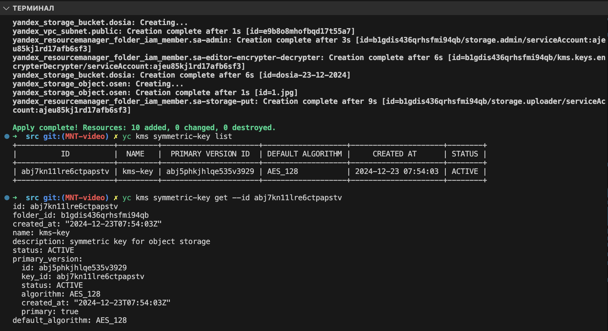
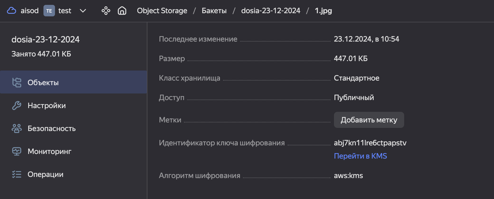
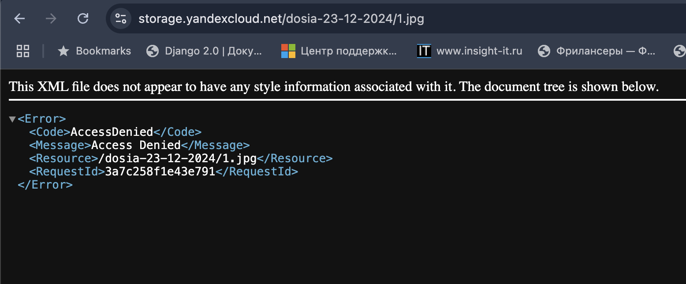

# Домашнее задание к занятию «Безопасность в облачных провайдерах»

Используя конфигурации, выполненные в рамках предыдущих домашних заданий, нужно добавить возможность шифрования бакета.

---
## Задание 1. Yandex Cloud  

Решение:

- подготовленные манифесты находятся в директории ./src

- список используемых команд:
```
terraform init
terraform apply
terraform validate
terraform plan

yc kms symmetric-key list
yc kms symmetric-key get --id abj7kn11lre6ctpapstv
```

- скриншоты выполнения и финальной работы:


